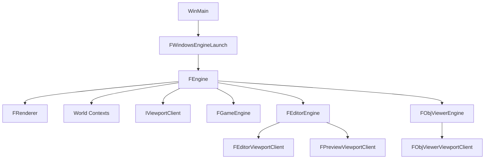

# Jungle Engine

`Jungle Engine`는 우리 팀이 만든 `C++20 + DirectX 11 + Win32 + ImGui` 기반의 커스텀 3D 엔진 프로젝트입니다.

이 저장소에는 단순히 엔진 라이브러리만 있는 것이 아니라, 그 엔진 위에서 동작하는 여러 실행 대상이 함께 들어 있습니다.

- `Engine`
  - 공용 런타임, 렌더러, 월드, 에셋 파이프라인
- `Editor`
  - 씬 편집과 디버깅을 위한 툴 실행 프로그램
- `Client`
  - 엔진을 게임 형태로 실행하는 가장 기본적인 런타임 앱
- `ObjViewer`
  - OBJ 모델을 빠르게 검수하고 `.Model`로 변환하는 전용 Viewer

즉, 이 프로젝트는 "엔진 소스"와 "그 엔진으로 실제로 만든 툴"이 함께 있는 구조입니다.

---

## 프로젝트를 한 문장으로 설명하면

**렌더러, 월드, 입력, 오브젝트 시스템, 에셋 로딩을 직접 구현한 엔진 위에 `Editor`와 `ObjViewer` 같은 도구를 얹은 프로젝트**입니다.

이 README는 루트 문서 기준으로 아래 내용을 한 번에 이해할 수 있게 쓰였습니다.

- 이 저장소에 어떤 실행 대상이 있는가
- `Engine`, `Editor`, `Client`, `ObjViewer`가 각각 무슨 역할을 하는가
- 공용 아키텍처가 어떻게 연결되는가
- 어떤 파일부터 읽으면 전체 구조를 빠르게 이해할 수 있는가
- 특히 `Editor Engine ObjViewer`는 어떤 목적으로 만들어졌는가

---

## 실행 대상

| 대상 | 역할 | 성격 |
| --- | --- | --- |
| `Engine` | 공용 엔진 코드와 DLL | 라이브러리 |
| `Editor` | 씬 편집, 오브젝트 선택, Gizmo, UI 패널, 미리보기 | 툴 |
| `Client` | 게임 씬을 가장 단순한 형태로 실행 | 런타임 샘플 |
| `ObjViewer` | OBJ import, 모델 검수, `.Model` export | 전용 툴 |

루트 저장소를 이해할 때는 보통 이렇게 보면 됩니다.

- `Engine`는 기반 기술
- `Editor`는 엔진 전체를 다루는 범용 툴
- `ObjViewer`는 에셋 검수에 집중한 작은 전용 툴
- `Client`는 엔진이 게임 런타임으로 어떻게 도는지 보여주는 가장 얇은 실행기

---

## Engine은 무엇을 담당하나

`Engine`은 프로젝트 전체의 공용 기반입니다.

핵심 역할은 아래와 같습니다.

- Win32 기반 실행 루프와 초기화
- DirectX 11 렌더러
- 월드와 씬 컨텍스트 관리
- `UObject - Actor - Component` 구조
- 입력 처리
- Debug Draw
- Physics / Timer / Console Variable 같은 런타임 보조 시스템
- OBJ / `.Model` 에셋 로드 및 저장

핵심 코드 축은 대략 아래처럼 볼 수 있습니다.

- `Engine/Source/Core/`
  - `FEngine`, 실행 루프, 플랫폼 연동, 경로, 콘솔 변수
- `Engine/Source/Renderer/`
  - 렌더러, 머티리얼, 셰이더, 렌더 커맨드
- `Engine/Source/World/`, `Engine/Source/Scene/`
  - 월드/씬 컨텍스트와 활성 씬 관리
- `Engine/Source/Object/`, `Engine/Source/Actor/`, `Engine/Source/Component/`
  - 런타임 객체 구조
- `Engine/Source/Asset/`
  - OBJ와 `.Model` 관련 에셋 파이프라인
- `Engine/Shaders/`
  - HLSL 셰이더

정리하면 `Engine`은 "도구를 띄우기 위한 뼈대"가 아니라, 실제로 렌더링과 월드 시뮬레이션을 수행하는 중심 코드입니다.

---

## Editor는 무엇을 담당하나

`Editor`는 엔진 전체를 다루기 위한 범용 편집 도구입니다.

이 프로젝트에서 `Editor`는 다음 같은 기능 계층을 가집니다.

- Editor 전용 엔진 계층
  - `FEditorEngine`
- Editor Viewport 계층
  - `FEditorViewportClient`
  - `FPreviewViewportClient`
  - `FEditorViewportRegistry`
- 편집 보조 서브시스템
  - Selection
  - Camera
- UI 패널
  - Outliner
  - Property
  - Control Panel
  - Console
  - Stat
  - Content Browser
- 편집 기능
  - Picking
  - Gizmo
  - Preview Scene

즉 `Editor`는 단순히 렌더 결과를 보여주는 창이 아니라, 씬을 선택하고 보고 수정하는 환경입니다.

구체적으로는 아래와 같은 특징이 있습니다.

- `Editor World`와 `Preview World`를 분리해서 다룹니다.
- 활성 Viewport에 따라 입력과 렌더링 라우팅이 달라집니다.
- Selection / Camera / Viewport 상태를 엔진과 UI가 함께 관리합니다.
- UI는 여러 패널과 오버레이를 조합해 작업 흐름을 만듭니다.

코드에서 보면 `FEditorEngine`가 공용 `FEngine`를 상속한 뒤, Editor 전용 Preview, Console, Camera, Viewport Routing, Slate Overlay, UI 초기화를 추가하는 구조입니다.

---

## ObjViewer는 무엇을 담당하나

`ObjViewer`는 이 저장소 안에서 가장 목적이 분명한 전용 도구입니다.

역할은 아주 명확합니다.

- `.obj` 파일을 빠르게 연다
- 축 방향과 배치를 맞춘다
- 카메라로 형태를 검수한다
- Wireframe / Normal / Grid로 메시 상태를 확인한다
- 최종적으로 엔진 전용 `.Model` 파일로 저장한다

즉 `ObjViewer`는 `Editor`처럼 전체 씬을 편집하는 툴이 아니라, **단일 모델을 빠르게 확인하고 정리하는 뷰어**입니다.

이 도구가 중요한 이유는, 엔진의 에셋 파이프라인과 렌더링 파이프라인이 실제 제품 형태로 묶여 있기 때문입니다.

---

## Client는 무엇을 담당하나

`Client`는 `FGameEngine` 기반의 가장 얇은 실행 대상입니다.

역할은 아래 정도로 이해하면 충분합니다.

- `Game` 월드 컨텍스트를 만든다
- 기본 `FGameViewportClient`를 사용한다
- 에디터 기능 없이 순수 런타임 장면을 돌린다

그래서 `Client`는 엔진을 게임처럼 실행하는 가장 단순한 진입점이고, `Editor`와 `ObjViewer`는 그 위에 목적별 기능을 얹은 툴이라고 볼 수 있습니다.

---

## 공용 아키텍처

이 저장소의 실행 대상은 서로 완전히 별개가 아니라, 공통 뼈대를 공유합니다.



핵심 아이디어는 아래 3가지입니다.

### 1. `FEngine`가 공통 실행 골격이다

`FEngine`는 다음 순서를 관리합니다.

- 런타임 시스템 초기화
- Renderer 생성
- World Context 초기화
- ViewportClient 생성
- 매 프레임 입력 / 물리 / 월드 Tick / 렌더 / 후처리 진행

즉 실행 대상이 달라도, 모두 같은 엔진 골격에서 출발합니다.

### 2. 차이는 `파생 Engine`과 `ViewportClient`가 만든다

- `FGameEngine`
  - 기본 게임 실행 흐름
- `FEditorEngine`
  - Editor World, Preview World, UI, Selection, Camera, Overlay
- `FObjViewerEngine`
  - 모델 Viewer 전용 Preview World, import/export, grid, normal visualization

그리고 실제 화면 동작 차이는 `IViewportClient` 파생 클래스가 담당합니다.

- `FGameViewportClient`
- `FEditorViewportClient`
- `FPreviewViewportClient`
- `FObjViewerViewportClient`

즉 렌더러는 공용으로 유지하고, "이 창을 어떤 규칙으로 다룰지"는 ViewportClient와 파생 Engine이 결정하는 구조입니다.

### 3. World는 역할에 따라 분리된다

이 프로젝트는 단일 월드만 두지 않습니다.

- `Game`
- `Editor`
- `Preview`

같은 목적별 World Context를 나눠서 사용합니다.  
이 구조 덕분에 Editor는 편집용 장면과 미리보기 장면을 함께 다룰 수 있고, ObjViewer도 별도 Preview World를 전용으로 가질 수 있습니다.

---

## 저장소 구조

```text
KraftonJungleEngine.sln
├─ Engine/
│  ├─ Source/
│  │  ├─ Core/
│  │  ├─ Renderer/
│  │  ├─ Scene/
│  │  ├─ World/
│  │  ├─ Object/
│  │  ├─ Actor/
│  │  ├─ Component/
│  │  ├─ Input/
│  │  ├─ Asset/
│  │  └─ Platform/
│  └─ Shaders/
├─ Editor/
│  ├─ Source/
│  │  ├─ UI/
│  │  ├─ Viewport/
│  │  ├─ Picking/
│  │  ├─ Gizmo/
│  │  ├─ Controller/
│  │  ├─ Pawn/
│  │  ├─ Subsystem/
│  │  └─ Slate/
│  └─ ThirdParty/
│     └─ imgui/
├─ Client/
│  └─ Source/
├─ ObjViewer/
│  ├─ Source/
│  └─ ObjViewer.vcxproj
├─ Assets/
│  ├─ Meshes/
│  ├─ Materials/
│  ├─ Scenes/
│  └─ Textures/
├─ Content/
│  ├─ Fonts/
│  ├─ Shaders/
│  └─ Textures/
└─ docs/
```

폴더를 빠르게 읽는 기준은 아래와 같습니다.

- `Engine/`
  - 공용 기반
- `Editor/`
  - 범용 편집 툴
- `ObjViewer/`
  - 모델 검수 전용 실행기
- `Client/`
  - 게임 런타임 예제
- `Assets/`
  - 메시, 재질, 장면, 텍스처 같은 런타임 데이터
- `Content/`
  - 폰트, 셰이더 캐시, 기타 보조 리소스

---

## 빌드와 실행

### 개발 환경

- `Windows x64`
- `Visual Studio 2022`
- `MSVC v143 Toolset`
- `Windows SDK 10.x`

### 전체 솔루션 빌드

```powershell
msbuild KraftonJungleEngine.sln /p:Configuration=Debug /p:Platform=x64
```

### 개별 빌드

```powershell
msbuild Engine\Engine.vcxproj /p:Configuration=Debug /p:Platform=x64
msbuild Editor\Editor.vcxproj /p:Configuration=Debug /p:Platform=x64
msbuild Client\Client.vcxproj /p:Configuration=Debug /p:Platform=x64
msbuild ObjViewer\ObjViewer.vcxproj /p:Configuration=Debug /p:Platform=x64
```

참고:

- `ObjViewer`는 링크 시 `Engine.lib`를 사용합니다.
- 빌드 후 `ObjViewer` 출력 폴더로 `Engine.dll`이 복사되도록 설정되어 있습니다.

### 실행 경로

```powershell
.\Editor\Bin\Debug\Editor.exe
.\Client\Bin\Debug\Client.exe
.\ObjViewer\Bin\Debug\ObjViewer.exe
```

기본 창 제목:

- `Editor`: `Jungle Editor`
- `Client`: `Jungle Client`
- `ObjViewer`: `Jungle ObjViewer`

---

## Editor 빠른 소개

루트 README 기준에서 `Editor`는 반드시 설명되어야 하는 핵심 대상입니다.

Editor에서 기대할 수 있는 작업은 다음과 같습니다.

- 씬과 Preview 장면을 전환하며 확인
- 오브젝트 선택
- Property 편집
- Gizmo 기반 조작
- Outliner / Content Browser / Console / Stat 패널 사용
- Viewport 중심 작업

Editor 관련 핵심 클래스는 아래와 같습니다.

- `Editor/Source/EditorEngine.h`
- `Editor/Source/Viewport/EditorViewportClient.h`
- `Editor/Source/Viewport/PreviewViewportClient.h`
- `Editor/Source/UI/EditorUI.h`
- `Editor/Source/Subsystem/EditorSelectionSubsystem.h`
- `Editor/Source/Subsystem/EditorCameraSubsystem.h`

Editor를 이해할 때는 "엔진에 UI를 얹은 프로그램"이라고 보기보다, **엔진 + 월드 라우팅 + 편집 서브시스템 + Viewport 정책 + UI 패널**이 함께 돌아가는 하나의 툴 체계라고 보는 편이 맞습니다.

---

## ObjViewer 빠른 소개

`ObjViewer`는 `Editor`보다 범위가 좁지만, 목적은 훨씬 선명합니다.

### ObjViewer 핵심 기능

- `.obj` 파일 열기
  - `File > Open OBJ`, Toolbar 버튼, 드래그 앤 드롭 지원
- Import Preset 지원
  - `Auto`, `Blender`, `Maya`, `3ds Max`, `Unreal`, `Unity`, `Custom`
- 축 변환
  - `Forward Axis`, `Up Axis`
- 배치 옵션
  - `Center To Origin`, `Place On Ground`, `Uniform Scale`, `Frame Camera After Import`
- 시각화 옵션
  - Wireframe, Vertex/Face Normal, Grid
- 정보 패널
  - 파일 정보, 메시 통계, Bounds, Camera 상태, Import Summary
- `.Model` export

### ObjViewer가 해결하는 문제

- 툴마다 다른 좌표계를 빠르게 맞추고 싶다
- OBJ가 너무 작거나 크거나, 원점이 이상할 때 빠르게 검수하고 싶다
- 메시의 기본 상태를 눈으로 확인하고 싶다
- 엔진에서 바로 쓰는 `.Model` 포맷으로 내보내고 싶다

### ObjViewer 화면 구성

- `Toolbar`
  - 열기, 다시 불러오기, export, 카메라 프레임, 카메라 리셋, 토글 옵션
- `Viewport`
  - 모델이 렌더링되는 메인 화면
- `Details`
  - 메시 / 바운드 / 카메라 / 시각화 옵션 확인

---

## ObjViewer 사용 방법

### 1. OBJ 불러오기

불러오는 방법은 3가지입니다.

- `File > Open OBJ...`
- `Toolbar > Open OBJ`
- `.obj` 파일을 Viewer 창에 드래그 앤 드롭

### 2. Import 옵션

중요한 옵션은 아래와 같습니다.

- `Source Preset`
- `Forward Axis`
- `Up Axis`
- `Center To Origin`
- `Place On Ground`
- `Frame Camera After Import`
- `Uniform Scale`

주의:

- `Forward Axis`와 `Up Axis`는 같은 축 기반을 동시에 쓸 수 없습니다.

### 3. Viewport에서 확인할 수 있는 것

- 카메라 회전 및 이동
- Wireframe 보기
- Vertex / Face Normal 보기
- Grid 보기

### 4. Reload / Export

- `Reload`
  - 마지막 import 옵션으로 원본 OBJ를 다시 불러옵니다.
- `Export .Model`
  - 현재 메시를 엔진 전용 `.Model`로 저장합니다.

기본 export 경로는 `Assets/Meshes` 기준입니다.

### 5. 조작법

| 기능 | 조작 |
| --- | --- |
| 카메라 회전 | Viewport 위에서 `RMB + 마우스 이동` |
| 전진 / 후진 | `RMB + W / S` |
| 좌 / 우 이동 | `RMB + A / D` |
| 위 / 아래 이동 | `RMB + Q / E` |
| 카메라 맞추기 | `Frame Camera` |
| 카메라 리셋 | `Reset Camera` |

---

## 코드 읽기 추천 순서

처음 합류한 사람이 전체 구조를 파악할 때는 아래 순서가 가장 빠릅니다.

### 1. 공용 실행 골격

- `Engine/Source/Core/Engine.h`
- `Engine/Source/Core/Engine.cpp`
- `Engine/Source/Platform/Windows/WindowsEngineLaunch.h`
- `Engine/Source/Core/ViewportClient.h`

여기서 공용 초기화 흐름과 ViewportClient 구조를 이해할 수 있습니다.

### 2. 가장 단순한 런타임 실행기

- `Client/Source/main.cpp`
- `Engine/Source/Core/GameEngine.h`
- `Engine/Source/Core/GameEngine.cpp`

이 경로가 제일 단순해서 엔진 기본 흐름을 파악하기 좋습니다.

### 3. Editor 계층

- `Editor/Source/main.cpp`
- `Editor/Source/EditorEngine.h`
- `Editor/Source/EditorEngine.cpp`
- `Editor/Source/UI/EditorUI.h`
- `Editor/Source/Viewport/EditorViewportClient.h`

여기서 "엔진 위에 편집 도구가 어떻게 추가되는지"를 볼 수 있습니다.

### 4. ObjViewer 계층

- `ObjViewer/Source/main.cpp`
- `ObjViewer/Source/ObjViewerEngine.h`
- `ObjViewer/Source/ObjViewerEngine.cpp`
- `ObjViewer/Source/ObjViewerShell.h`
- `ObjViewer/Source/ObjViewerViewportClient.h`

ObjViewer는 목적이 좁아서 엔진 기반 구조를 이해하기에 오히려 읽기 쉬운 편입니다.

### 5. 에셋 파이프라인

- `Engine/Source/Asset/ObjManager.h`
- `Engine/Source/Asset/ObjManager.cpp`

OBJ와 `.Model` 사이의 연결을 보려면 여기까지 보면 됩니다.

---

## 현재 범위와 한계

현재 저장소를 이해할 때 같이 알고 있어야 할 한계는 아래와 같습니다.

- `Windows` 중심 프로젝트입니다.
- 검증은 별도 유닛 테스트보다 빌드와 수동 확인 비중이 큽니다.
- `Editor`는 범용 툴이지만 상용 엔진 수준의 거대한 기능 집합을 목표로 하지는 않습니다.
- `ObjViewer`는 의도적으로 단일 모델 검수에 집중합니다.
- 저장소 전체는 "엔진 실험 + 툴 구현 + 파이프라인 연결" 성격이 강합니다.

이 점은 약점이기도 하지만, 동시에 장점이기도 합니다.  
기능을 무한히 넓히기보다, **엔진 기반 구조를 직접 구현하고 실제 툴로 연결했다**는 점이 이 프로젝트의 핵심 가치이기 때문입니다.

---

## 한 줄 요약

`Jungle Engine`는 커스텀 3D 엔진 프로젝트이고,  
`Editor`는 그 엔진을 다루는 범용 편집 툴이며,  
`ObjViewer`는 OBJ import와 `.Model` export에 집중한 전용 에셋 Viewer입니다.
